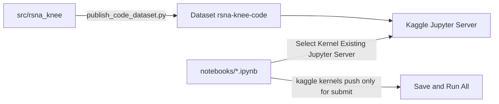

# Kaggle Jupyter Server workflow + repo cleanup

We do **not** need MCP. MCP is an API for an agent to list/push kernels. The article’s Steps 2–5 (and [Kaggle’s notebook docs](https://www.kaggle.com/docs/notebooks)) are **Kaggle Jupyter Server**: Cursor runs your local `.ipynb` cells on Kaggle hardware.

MCP vs Jupyter Server:

- **Jupyter Server (this plan):** you edit in Cursor; cells execute on Kaggle (`/kaggle/input`, GPU). Daily loop.
- **MCP:** agent can `save_notebook` / download outputs without the UI. Not required if you connect the kernel yourself.
- **Save & Run All:** still required for a **competition submission**. A Cursor-connected session does not create a scored kernel version. The local `.ipynb` is **not synced** to the Kaggle notebook file (Kaggle documents this).

## Daily loop (article Steps 2–5)

From [Kaggle: Connect from VS Code](https://www.kaggle.com/docs/notebooks) — Cursor is a VS Code-powered editor, same kernel picker.

1. On Kaggle, open the EDA or train kernel. Attach competition data + Dataset `simonhochwebde/rsna-knee-code`. Pick GPU if training.
2. **Run → Kaggle Jupyter Server** → **Start** session.
3. Copy the **VS Code Compatible URL** under **Manually Connect**.
4. In Cursor, open [`notebooks/02_eda_phase0.ipynb`](notebooks/02_eda_phase0.ipynb) or [`notebooks/03_phase1_image_baseline.ipynb`](notebooks/03_phase1_image_baseline.ipynb).
5. Kernel picker → **Select Another Kernel** → **Existing Jupyter Server** → paste the URL → name it e.g. `Kaggle GPU`. Run cells. `!nvidia-smi` to confirm.

Reconnect with a new URL if the session times out. Jupyter extension must be available in Cursor (same as VS Code).

**Remote imports:** the kernel’s filesystem is Kaggle, not your Windows repo. `from rsna_knee...` only works if `src/` is on Kaggle (Dataset), not via local `sys.path`. That is why we still publish `rsna-knee-code` and put a short setup cell in the notebooks:

- If `/kaggle/input/rsna-knee-code/src` exists → use it (remote)
- Else → repo `src/` (local smoke tests)

No git clone. EDA can keep internet ON; train stays internet OFF for submit.

## Submit path (not the daily loop)

When you want a leaderboard version:

1. `python scripts/publish_code_dataset.py` if `src/` or `configs/` changed
2. Copy the source notebook into the kernel folder and `kaggle kernels push` (thin helper, not a generator)
3. On Kaggle: **Save Version → Save & Run All**, then submit `submission.csv`

Keep [`kaggle/eda/kernel-metadata.json`](kaggle/eda/kernel-metadata.json) and [`kaggle/train/kernel-metadata.json`](kaggle/train/kernel-metadata.json) as push settings only. Do not keep generated `kaggle/*/…ipynb` in git.

## Collapse notebooks + one Dataset script

**Edit only** the two notebooks above. Stop injecting bootstrap via `sync_kaggle_*.py`.

Extract staging from [`scripts/sync_kaggle_train.py`](scripts/sync_kaggle_train.py) into [`scripts/publish_code_dataset.py`](scripts/publish_code_dataset.py) (`src/` + `configs/` → Dataset `simonhochwebde/rsna-knee-code`).

Slim [`configs/kaggle_eda.yaml`](configs/kaggle_eda.yaml) / [`configs/kaggle_train.yaml`](configs/kaggle_train.yaml). Fix [`src/rsna_knee/utils/config.py`](src/rsna_knee/utils/config.py) error text; drop unused `rsna_knee_vendor` path.

## Delete bloat

Disk: `rsna_knee_repo/`, `kaggle/eda/run_output/`, `kaggle/eda/pull_test/`, staged `kaggle/datasets/rsna-knee-code/` contents, `rsna-knee-eda-phase-0.log`, `kaggle/eda/run_log.txt`.

Tracked: `scripts/sync_kaggle_*.py`, `scripts/build_*.py`, [`kaggle/kernel-metadata.json`](kaggle/kernel-metadata.json), [`kaggle/kernels/train_template.ipynb`](kaggle/kernels/train_template.ipynb), generated kernel notebooks, [`docs/KAGGLE_NOTEBOOK_SYNC.md`](docs/KAGGLE_NOTEBOOK_SYNC.md) (merge into [`docs/KAGGLE.md`](docs/KAGGLE.md)).

Tighten [`.gitignore`](.gitignore). Keep `kaggle/*/runs/` for optional downloaded outputs.

## Docs and skills

Rewrite [`docs/KAGGLE.md`](docs/KAGGLE.md), [`docs/DEVELOPMENT.md`](docs/DEVELOPMENT.md), [`README.md`](README.md) around Jupyter Server + Dataset + submit push.

Replace push/pull skills with one skill: how to connect the kernel, when to publish the Dataset, when to `kernels push` for submit. No MCP.

## Out of scope

Last Phase 1 run died on **Tesla P100 vs current Kaggle PyTorch**. In the Jupyter Server panel pick a T4 (or whatever the image supports), not P100.
