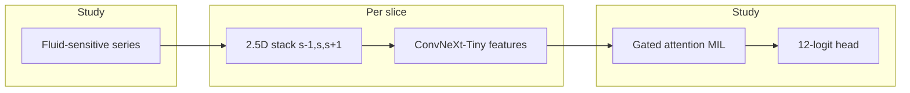

# Phase 1 image baseline notebook (offline-submittable)

## Goal

A **train + submit** notebook for the 58 explicitly labeled studies that:

- Uses a strong, competition-proven stack (pretrained 2.5D ConvNeXt + gated attention MIL + mixup + k-fold + TTA)
- Writes `submission.csv` with no reports at inference
- Runs on Kaggle **with internet disabled** (required for scoring)

This is still Phase 1: image-only. Report pseudo-labels stay Phase 2. With n=58, a giant 3D/foundation model would overfit and is harder to ship offline; the techniques below are the usual winning pattern on small-label RSNA tasks.

## Offline constraint (this is the main design change vs EDA)

The EDA kernel clones GitHub and pip-installs ([`scripts/sync_kaggle_eda.py`](scripts/sync_kaggle_eda.py)). **That fails on submission.**

| Need | Offline approach |
|------|------------------|
| Package code | Vendor `src/rsna_knee/` into the generated Kaggle notebook (write files to `/kaggle/working`, then `sys.path`) — no git, no pip |
| Python deps | Use only what the Kaggle GPU image already has: `torch`, `torchvision`, `numpy`, `pandas`, `pydicom`, `sklearn` |
| ImageNet weights | Load a local `.pth` from a Kaggle Dataset (torchvision `DEFAULT` weights download from the internet) |

One-time user step: run `scripts/export_pretrained_weights.py` locally, upload `convnext_tiny_imagenet.pth` as a Kaggle dataset (e.g. `rsna-knee-pretrained`), attach it in kernel metadata. The notebook **fails fast** on Kaggle if weights are missing (do not silently train from random init).

Locally, the same script/path can download once into gitignored `data/pretrained/`.

## Model and training (library, not notebook cells)

Reusable logic in `src/rsna_knee/` (project rule). Notebook stays thin, like Phase 0.

**Data** — extend [`src/rsna_knee/data/dataset.py`](src/rsna_knee/data/dataset.py):

- `KneeStudyDataset`: labeled studies only (`labels_present_mask`); test mode = IDs only
- Prefer fluid-sensitive series; take up to 3 planes (sag / cor / ax) when present
- Sort slices via existing `load_series_volume` (`InstanceNumber`)
- Percentile-normalize, sample **16** slices, resize to **256×256**, stack adjacent slices as 3-channel 2.5D
- Cache processed volumes in memory (58 studies ≈ 0.5 GB) so DICOM I/O is not per-epoch
- Return `image [S, 3, 256, 256]`, `labels [12]`, `mask [12]` (NaN-safe even though all 58 are complete)

**Model** — new [`src/rsna_knee/models/mil_2p5d.py`](src/rsna_knee/models/mil_2p5d.py):

- `torchvision.models.convnext_tiny(weights=None)` + load bundled ImageNet state dict into `features`
- Gated attention pooling over slices (Ilse et al.)
- Linear head → 12 logits
- Replace classifier; do not use reports

**Train** — new modules under [`src/rsna_knee/training/`](src/rsna_knee/training/):

- Masked BCE-with-logits + `pos_weight` from labeled prevalence
- Study-level 5-fold (`sklearn` KFold; n=58)
- AdamW + cosine, mixup on slice tensors, simple MRI augs (flip, small rotate, contrast) via `torchvision` — no `timm` / MONAI / `transformers` / `albumentations` (those need pip)
- Metric: existing `macro_roc_auc`
- Inference: mean of fold checkpoints + horizontal-flip TTA
- Stream test studies (hidden test may be large); do not cache the full test set

Reuse [`predictions_to_submission`](src/rsna_knee/data/schema.py) for Kaggle column names.

**Config** — update [`configs/default.yaml`](configs/default.yaml) and [`configs/kaggle.yaml`](configs/kaggle.yaml): `model.name: convnext_tiny_mil`, `use_report_text: false`, `volume_shape: [16, 256, 256]`, modest epochs/batch so 5-fold on 58 fits a Kaggle GPU session. Keep `kaggle.yaml` data root compatible with [`default_data_root()`](src/rsna_knee/utils/paths.py) (`/kaggle/input/competitions/...` and `/kaggle/input/...`).

## Notebook and Kaggle kernel

Follow the EDA split:

| Edit | Generated |
|------|-----------|
| [`notebooks/03_phase1_image_baseline.ipynb`](notebooks/03_phase1_image_baseline.ipynb) | [`kaggle/train/train.ipynb`](kaggle/train/train.ipynb) |

Notebook cells (thin):

1. Setup / paths / labeled-count sanity check
2. Prevalence baseline (constant positive rates → `submission.csv` floor)
3. Build dataset + model, print parameter count
4. 5-fold train (1 epoch + skip MIL on local sample data if no GPU; full train on Kaggle)
5. OOF macro ROC-AUC
6. Test inference → `/kaggle/working/submission.csv`

New generator (EDA-style, **no git clone**): `scripts/sync_kaggle_train.py` injects a vendor cell that writes current `src/rsna_knee/**/*.py` into `/kaggle/working`, then `sys.path`. Kernel metadata:

- `enable_internet: false`
- `enable_gpu: true`
- `competition_sources: [rsna-knee-abnormality-detection]`
- `dataset_sources: [your pretrained-weights dataset]`

Replace the TODO in [`kaggle/kernels/train_template.ipynb`](kaggle/kernels/train_template.ipynb) with a pointer to this notebook so it is not a second source of truth.

## Tests and docs

- Tests use `pytest.importorskip("torch")` so CI (`pip install -e ".[dev]"` only) stays unchanged
- Cover: dataset tensor shapes on sample DICOMs, masked loss, `predictions_to_submission`, weights resolver does not hit the network when a local file exists
- Update [`docs/KAGGLE.md`](docs/KAGGLE.md) (offline submit path), [`docs/PROJECT_LOG.md`](docs/PROJECT_LOG.md) (Phase 0 done, Phase 1 in progress), gitignore `data/pretrained/`
- Document ImageNet ConvNeXt-Tiny license (BSD / torchvision) for competition pretrained-weight rules

## Out of scope

- Report NLP / pseudo-labels (Phase 2)
- HuggingFace / DINOv2 / MONAI (internet or extra wheels)
- Training on the 4,349 unlabeled studies
