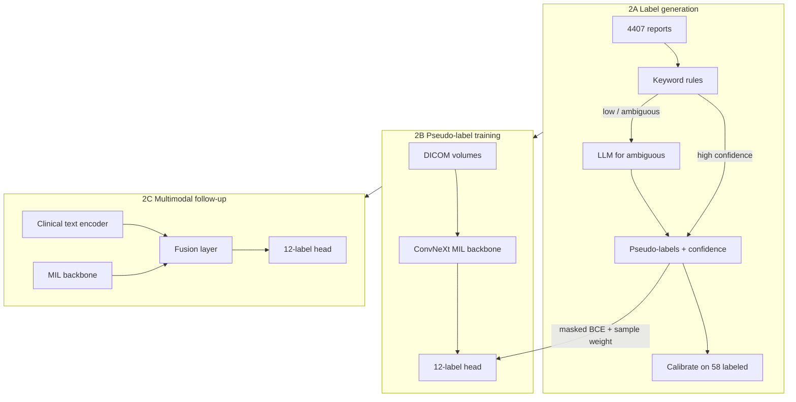

# RSNA Knee — Phase 2 Plan

## Status

| Phase | Status |
|-------|--------|
| 0 — EDA | **Done** |
| 1 — Image baseline | **Done** (interactive GPU run; OOF 0.5295; `submission.csv` validated) |
| 2 — Reports / semi-supervised | **Starting now** |

**Design decisions (confirmed):**
- **Report labeling:** Hybrid — keyword rules first, LLM for ambiguous cases; calibrate on 58 labeled studies
- **Training:** Pseudo-label image MIL first → multimodal fusion as follow-up experiment
- **Pretrained models:** Compared inside Phase 2 (not a separate pre-Phase-2 step)

**Phase 1 baseline to beat:** OOF macro ROC-AUC **0.5295** (from-scratch ConvNeXt-Tiny MIL, 58 labeled studies only).

---

## Architecture overview



**Competition constraint:** Reports and text encoder are **train-only**. Test inference remains image-only.

---

## Phase 2A — Hybrid report labeling

### 2A.1 Report EDA (Kaggle, ~1 session)

Run in [`notebooks/02_eda_phase0.ipynb`](notebooks/02_eda_phase0.ipynb) or a new EDA section:

- Language distribution (English / Spanish / German / other)
- Report length stats
- Per-label keyword hit rates on 58 labeled studies (sanity check for rule coverage)
- Log findings in [`docs/PROJECT_LOG.md`](docs/PROJECT_LOG.md)

Existing hook: [`StudyIndex.report_for_study()`](src/rsna_knee/data/dataset.py) already reads the `Report` column.

### 2A.2 Rule-based labeler

New module: `src/rsna_knee/reports/`

```
src/rsna_knee/reports/
  __init__.py
  rules.py       # per-label keyword lists, negation patterns, multilingual synonyms
  llm.py         # LLM extraction for low-confidence / ambiguous cases
  hybrid.py      # merge rules + LLM, output labels + confidence
  evaluate.py    # precision/recall/F1 vs 58 ground-truth per label
```

**`rules.py` responsibilities:**
- Per-label keyword dictionaries (EN + DE + ES at minimum, from EDA)
- Negation handling ("no effusion", "kein Erguss", etc.)
- Output: `(labels: float[12], confidence: float[12], source: str)` per study
- Flag studies where rules are ambiguous (no clear match, conflicting signals)

**Validation gate:** Run on 58 labeled studies before generating labels for 4,349 report-only studies. Target: reasonable per-label precision (exact threshold TBD from EDA; prioritize not poisoning training with false positives).

### 2A.3 LLM labeler (ambiguous cases only)

**`llm.py` responsibilities:**
- Structured prompt: extract 12 binary labels from radiology report JSON output
- Process only studies routed from rules (low confidence / ambiguous)
- Multilingual: prompt in English, report text as-is
- Offline Kaggle constraint: LLM weights must be attached as a Kaggle Dataset (like ImageNet weights today); no internet at submit time

**`hybrid.py` merge logic:**
1. Rules run on all 4,407 studies
2. High-confidence rule hits → final label
3. Ambiguous → LLM extraction
4. Explicit 58 labeled studies → always use ground truth (never pseudo-label)

**Output artifact:** `pseudo_labels.parquet` (or CSV) with columns: `StudyInstanceUID`, 12 label columns, 12 confidence columns, `label_source`.

---

## Phase 2B — Pseudo-label image training

### Dataset changes

Extend [`KneeStudyDataset`](src/rsna_knee/data/dataset.py):

| Parameter | Phase 1 | Phase 2 |
|-----------|---------|---------|
| `labeled_only` | `True` | `False` |
| Label source | CSV ground truth | Ground truth for 58 + pseudo-labels for rest |
| Confidence | implicit 1.0 | per-label confidence from hybrid labeler |

Add optional `pseudo_labels_path` config key. Studies with explicit labels always prefer ground truth.

### Training loop changes

Extend [`run_kfold_training()`](src/rsna_knee/training/loop.py):

- **CV strategy:** Keep study-level k-fold, but evaluate OOF **only on 58 labeled studies** (same metric as Phase 1 for fair comparison)
- **Loss:** Confidence-weighted masked BCE: `loss *= confidence_mask` per label
- **Sample weighting:** Optionally down-weight low-confidence pseudo-labels (configurable threshold)
- **Train set:** All 4,407 studies (or high-confidence subset initially for a safer first run)

### Config

New [`configs/phase2.yaml`](configs/phase2.yaml) (and `configs/kaggle_phase2.yaml`):

```yaml
model:
  name: convnext_tiny_mil
  allow_random_init: false          # pretrained comparison starts here
  pretrained_weights: convnext_tiny_imagenet.pth

data:
  labeled_only: false
  pseudo_labels_path: outputs/pseudo_labels.parquet
  min_confidence: 0.7               # threshold for including pseudo-labels

training:
  confidence_weighted_loss: true
  eval_labeled_only: true             # OOF metric on 58 labeled only
```

### Notebook

New [`notebooks/04_phase2_pseudo_labels.ipynb`](notebooks/04_phase2_pseudo_labels.ipynb):

1. Generate hybrid pseudo-labels (or load cached artifact)
2. Validate on 58 labeled (per-label PR curves)
3. Train image MIL on expanded dataset
4. OOF on 58 labeled → compare to Phase 1 baseline (0.5295)
5. Test inference → `submission.csv` (image-only, unchanged)

### Pretrained backbone comparison (within Phase 2)

Run the **same pseudo-label setup** with different init strategies; log OOF side-by-side:

| Variant | Weights | Notes |
|---------|---------|-------|
| `scratch` | random init | Phase 1 baseline reference (58 labeled only) |
| `imagenet` | ConvNeXt-Tiny ImageNet | [`scripts/export_pretrained_weights.py`](scripts/export_pretrained_weights.py) |
| `radimagenet` | RadImageNet ConvNeXt (if rules permit) | Export + document license in PROJECT_LOG |
| *(future)* | Other backbones | Same MIL head, swap backbone in `build_model()` |

Generalize [`resolve_pretrained_weights()`](src/rsna_knee/models/weights.py) to accept `filename` per config variant. Each variant = one Kaggle run with identical pseudo-labels for fair comparison.

---

## Phase 2C — Multimodal fusion (follow-up experiment)

After pseudo-label baseline shows lift:

### New modules

```
src/rsna_knee/models/
  multimodal.py    # text encoder + fusion with MIL features
src/rsna_knee/reports/
  encoding.py      # tokenize + embed reports at train time
```

### Design

- **Train:** Image MIL features + report embedding → fused 12-label head
- **Inference:** Image MIL features only (text branch dropped or zeroed)
- **Supervision:** Ground truth on 58 + pseudo-labels on 4,349 (same as 2B)
- Text encoder candidates: ClinicalBERT, BioClinicalBERT, or multilingual clinical model — attached as Kaggle Dataset

### Notebook

Extend `04_phase2_pseudo_labels.ipynb` or add `05_phase2_multimodal.ipynb` once 2B baseline exists.

---

## Implementation order

1. **Report EDA** — language, length, keyword coverage (informs rule dictionaries)
2. **`reports/rules.py` + `evaluate.py`** — validate on 58 labeled
3. **`reports/llm.py` + `hybrid.py`** — generate full pseudo-label artifact
4. **Dataset + loop extensions** — confidence-weighted training on 4,407 studies
5. **`04_phase2_pseudo_labels.ipynb`** — end-to-end with ImageNet pretrained (first meaningful comparison)
6. **Pretrained variants** — RadImageNet etc. under same pseudo-labels
7. **Multimodal branch** — after pseudo-label image model beats Phase 1 baseline

---

## Phase 1 housekeeping (parallel, low priority)

- Offline kernel submit (`push_kaggle_kernel.py train` → Save & Run All)
- Log OOF 0.5295 + LB score in [`docs/PROJECT_LOG.md`](docs/PROJECT_LOG.md)
- Does not block Phase 2 work

---

## Success criteria

| Milestone | Target |
|-----------|--------|
| Rule labeler on 58 labeled | Per-label precision documented; no systematic false-positive patterns |
| Pseudo-label training | OOF on 58 labeled **> 0.53** (beat Phase 1 from-scratch) |
| ImageNet + pseudo-labels | Meaningful lift vs scratch + pseudo-labels |
| Multimodal | Additional lift over best image-only pseudo-label model |
| Submission | Reproducible offline Kaggle path (internet OFF) |

---

## What not to do

- Don't use reports at inference
- Don't commit pseudo-label artifacts or LLM weights to git (Kaggle Dataset / `/kaggle/working`)
- Don't skip validation on 58 labeled before training on 4,349 pseudo-labels
- Don't compare pretrained models on different pseudo-label sets — generate labels once, swap backbones
