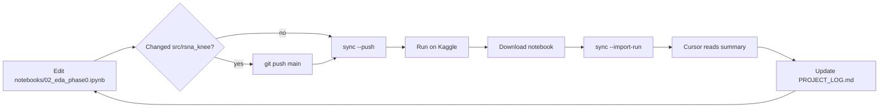

# Kaggle notebook sync workflow

How to move EDA notebook changes and run results between **local development (Cursor)** and **Kaggle**.

## Roles

| Artifact | Role |
|----------|------|
| `notebooks/02_eda_phase0.ipynb` | **Source of truth** — edit analysis cells here (with Cursor) |
| `kaggle/eda/eda_phase0.ipynb` | **Generated** — bootstrap cells added; never edit by hand |
| `src/rsna_knee/` | Shared library — cloned on Kaggle in the bootstrap cell |
| `docs/PROJECT_LOG.md` | **Confirmed findings** — update after reviewing a Kaggle run |
| `kaggle/eda/runs/latest.ipynb` | Last downloaded run with outputs (gitignored, local only) |
| `kaggle/eda/runs/last_run_summary.txt` | Text summary of `latest.ipynb` for quick review / agent context |

Settings: `configs/kaggle_eda.yaml`  
Kernel: [simonhochwebde/rsna-knee-eda-phase-0](https://www.kaggle.com/code/simonhochwebde/rsna-knee-eda-phase-0)

---

## Push: local → Kaggle

Use when you (or Cursor) added/changed notebook cells or `src/rsna_knee/` code.

1. **Edit** `notebooks/02_eda_phase0.ipynb` locally.
2. If you changed **`src/rsna_knee/`**, commit and **push to GitHub** first  
   (Kaggle bootstrap clones `main` from `configs/kaggle_eda.yaml`).
3. Regenerate and push the Kaggle copy:

   ```bash
   python scripts/sync_kaggle_eda.py --push
   ```

4. On Kaggle:
   - **Session → Restart session** if bootstrap or library code changed (clears stale `/kaggle/working/rsna_knee_repo`).
   - Open the kernel → **Run All** (interactive) or **Save version → Save & Run All** (batch commit).

5. Sanity check in the setup cell:

   ```
   Environment : Kaggle
   Data root   : /kaggle/input/competitions/rsna-knee-abnormality-detection
   ```

---

## Pull: Kaggle → local (for Cursor to review)

Kaggle exposes different things depending on how you ran the notebook:

| What you want | How to get it | Includes cell outputs? |
|---------------|---------------|-------------------------|
| Notebook **source** (no outputs) | `python scripts/sync_kaggle_eda.py --pull` | No |
| **Commit run** logs (stdout/stderr) | `python scripts/sync_kaggle_eda.py --logs` | Partial (text only) |
| **Full run with outputs** (tables, plots) | Kaggle UI → **Download notebook** | Yes |

### Recommended: import a downloaded run

After you download the executed notebook from Kaggle (e.g. to `Downloads/`):

```bash
python scripts/sync_kaggle_eda.py --import-run "C:\Users\marie\Downloads\rsna-knee-eda-phase-0.ipynb"
```

This copies the file to `kaggle/eda/runs/latest.ipynb` and writes `kaggle/eda/runs/last_run_summary.txt`.  
Then ask Cursor to read those paths — no need to `@`-mention Downloads each time.

### After reviewing a run

1. Tell Cursor to read `kaggle/eda/runs/last_run_summary.txt` (or `latest.ipynb`).
2. Update **`docs/PROJECT_LOG.md`** with confirmed numbers and decisions.
3. Merge any **analysis cell changes** from Kaggle back into `notebooks/02_eda_phase0.ipynb` manually  
   (ignore bootstrap cells when copying — they are re-injected by the sync script).

---

## Loop with Cursor



**Typical prompts:**

- *"Add step 3 to the EDA notebook, then push to Kaggle."*
- *"I downloaded the Kaggle run — import it and summarize the results."*  
  (after running `--import-run`, or attach the file)
- *"Update PROJECT_LOG from the last Kaggle run."*

---

## One-time setup

1. [Kaggle API token](https://www.kaggle.com/settings/api) → `kaggle auth login` or `%USERPROFILE%\.kaggle\access_token`
2. Competition data attached to the kernel (`kernel-metadata.json` → `competition_sources`)
3. **Internet enabled** on the kernel (bootstrap clones GitHub)

---

## Troubleshooting

| Symptom | Fix |
|---------|-----|
| `Local run — skipping Kaggle bootstrap` on Kaggle | Old kernel version — `--push` again; use `KAGGLE_KERNEL_RUN_TYPE` detection (fixed in repo) |
| `Environment : local` on Kaggle | Stale clone or old GitHub code — **Restart session**, ensure `paths.py` fix is on `main` |
| `FileNotFoundError: .../data/sample/train.csv` | Same as above — data root fell back to local sample path |
| `--pull` has no outputs | Expected — use **Download notebook** + `--import-run` |
| `--logs` shows ERROR | Read log; often CSV path or missing competition input |
| Bootstrap installs old code | Restart session, or bootstrap now runs `git pull` when clone exists |

---

## Commands reference

```bash
python scripts/sync_kaggle_eda.py              # regenerate kaggle/eda/eda_phase0.ipynb
python scripts/sync_kaggle_eda.py --push       # regenerate + upload to Kaggle
python scripts/sync_kaggle_eda.py --pull       # download source from Kaggle (no outputs)
python scripts/sync_kaggle_eda.py --logs       # fetch last commit run log
python scripts/sync_kaggle_eda.py --import-run PATH   # copy downloaded run + write summary
```
